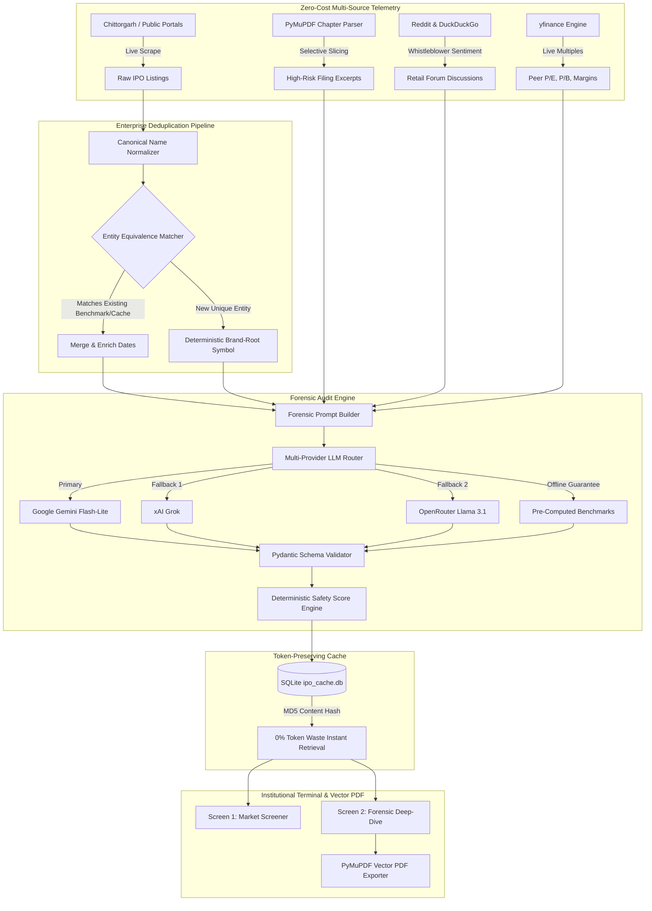

# ⚖️ ProspectusIQ — Autonomous IPO Forensic Auditor & Offering Screener
### *Institutional-Grade IPO Due Diligence, Capital Integrity Scoring & Prospectus Telemetry*

[](https://www.python.org/)
[](https://streamlit.io/)
[](https://ai.google.dev/)
[](https://pymupdf.readthedocs.io/)
[](LICENSE)
[](tests/)

---

## 📌 Executive Summary & Problem Statement

Every year, retail investors pour tens of billions of dollars into Initial Public Offerings (IPOs), only to face severe capital destruction:
* **The Information Asymmetry:** Investment banking syndicates package companies with glossy brochures while burying catastrophic risks inside **400 to 700-page** Draft Red Herring Prospectuses (DRHP / S-1 filings).
* **The Hidden Wealth Destroyers:** 
  1. **Offer for Sale (OFS) Exits:** Venture backers and promoters dumping 60–100% of their equity without a single rupee entering company treasury.
  2. **Aggressive Revenue Recognition & Cash Burn:** Operating cash flow (CFO) plummeting into severe deficit while reported net profit (PAT) appears artificially buoyant.
  3. **Related-Party Siphoning & Lawsuits:** Undisclosed inter-company loans, personal promoter guarantees, and contingent litigations representing 50%+ of net worth.
  4. **30/90-Day Anchor Lock-in Cliffs:** Massive post-listing share dumping by institutional anchor investors that crushes secondary market prices.

**ProspectusIQ** bridges this divide. It is an **autonomous, institutional-grade IPO forensic terminal** that extracts high-risk regulatory chapters, aggregates retail forum sentiment, benchmarks competitor valuation multiples, and executes a mathematically weighted **12-factor forensic rubric** in seconds—generating verifiable institutional equity research notes and PDF reports.

---

## 🏛️ System Architecture



---

## 🔬 The 12-Factor Forensic Rubric

Every IPO is evaluated across **12 deterministic, weighted forensic parameters** categorized into three institutional risk vectors:

| Category | Parameter ID | Parameter Name | Weight | Primary Forensic Focus |
| :--- | :---: | :--- | :---: | :--- |
| **🏛️ Category A:<br>Capital Integrity<br>(50% Weight)** | **#1** | **Use of Proceeds** | `15%` | Fresh capital allocation vs. 100% OFS exit by early investors. |
| | **#2** | **Pre-IPO Allotment Disparity** | `10%` | Compares acquisition price of insiders (last 12 mo) vs. public band. |
| | **#3** | **Related-Party Siphoning** | `10%` | Loans to subsidiaries, promoter group royalties, and personal guarantees. |
| | **#4** | **Litigation Exposure** | `10%` | Contingent liabilities & statutory tax demands as % of net worth. |
| | **#5** | **Promoter Share Pledging** | `5%` | Promoter encumbrances, secondary debt collateralization, and lock-ins. |
| **📊 Category B:<br>Earnings Quality<br>& Moat (30% Weight)** | **#6** | **CFO vs. PAT Divergence** | `10%` | Quality of earnings: Cash flow from operations vs. accounting net profit. |
| | **#7** | **Customer Concentration** | `10%` | Revenue dependency on top 5/10 clients or counterparty credit risks. |
| | **#8** | **Operating Margin Moat** | `10%` | EBITDA margin trajectory, pricing power, and variable cost leverage. |
| | **#9** | **Valuation vs. Peers** | `10%` | Trailing/Forward P/E, EV/Sales, and P/B relative to listed competitors. |
| **⚖️ Category C:<br>Valuation & Overhang<br>(20% Weight)** | **#10** | **Regulatory Vulnerability** | `5%` | Policy headwinds, tariff vulnerability, and statutory compliance caps. |
| | **#11** | **Anchor Lock-In Expiry** | `2.5%` | Supply cliff: 30-day and 90-day post-listing anchor share release. |
| | **#12** | **Forum vs. Reality Split** | `2.5%` | Crowd sentiment (Reddit/DDG) vs. prospectus disclosures divergence. |

### Scoring & Decision Engine
* **Institutional Safety Score (0–100):** Mathematically computed from weighted factor statuses (`GREEN` = 100%, `YELLOW` = 50%, `RED` = 0%, with severe penalties for `CRITICAL` governance red flags).
* **Actionable Verdicts:**
  * `🟢 Long-Term Compounder` (Score ≥ 70, moat verified, clean capital structure)
  * `🔵 Apply for Listing Gains` (Score 50–69, short-term momentum, lock-in watch)
  * `🟡 High Risk Speculative` (Score 35–49, elevated debt, OFS heavy, valuation stretch)
  * `🔴 Avoid` (Score < 35, related-party siphoning, litigation overhang, negative CFO)

---

## ⚡ Key Engineering Features

### 1. Enterprise Entity Resolution & Deduplication Pipeline (`core/entity_resolver.py`)
Eliminates duplicate listings arising from web scraper string variations:
* **Canonical Normalization:** Strips corporate suffixes (`Limited`, `Ltd`, `Pvt Ltd`, `Corp`, `LLP`, `Inc`, `India`, parentheticals).
* **Deterministic Symbol Generation:** Extracts brand root symbols (`"Swiggy Limited"` &rarr; `SWIGGY`, `"Hero Motors Limited"` &rarr; `HEROMOTO`, `"National Stock Exchange"` &rarr; `NSE`).
* **3-Layer Idempotent Protection:** Guards against duplicate entries across web ingestion, SQLite persistence, and UI leaderboard grids.

### 2. Targeted Chapter Slicing (<80k Tokens) (`core/pdf_processor.py`)
Full 700-page DRHPs exceed token limits and induce LLM hallucinations. ProspectusIQ uses PyMuPDF regex pattern recognition to slice only high-risk chapters:
* *Objects of the Issue / Use of Proceeds*
* *Internal & External Risk Factors*
* *Capital Structure & Shareholding Pattern*
* *Related Party Transactions*
* *Outstanding Litigations & Government Demands*

### 3. Multi-Provider LLM Fallback Cascade (`core/llm_router.py`)
Guarantees **zero demo failures and high availability**:
1. **Primary Provider:** Google Gemini Flash-Lite (`response_mime_type="application/json"`).
2. **First Fallback:** xAI Grok (`grok-beta` via OpenAI SDK).
3. **Second Fallback:** OpenRouter (`meta-llama/llama-3.1-70b-instruct`).
4. **Infallible Benchmark Fallback:** High-conviction institutional benchmark reports for offline testing.

### 4. Publication-Quality Institutional PDF Exporter (`core/pdf_exporter.py`)
Generates publication-grade research notes using PyMuPDF vector drawing primitives:
* **High-Density Typography:** Pitch-black ink (`#05080D`) with high contrast.
* **Executive Summary Box & Bull/Bear Matrix:** Two-column balance sheet with clear strengths and governance flags.
* **Complete 12-Factor Breakdown:** Categorized factor cards with verified prospectus citations.
* **Divergence Analyzer & Footnotes:** Crowd sentiment vs. regulatory filing reality split.

### 5. Two-Screen Minimalist Dark Terminal UI (`app.py`)
* **Screen 1: 📊 Market Screener (Macro View):**
  * Top Macro KPI Bar (Tracked IPOs, Institutional Grade, High-Risk, Open for Bidding).
  * Auto-filtered to active and upcoming offerings by default (closed IPOs removed).
  * Interactive Leaderboard with single-click row selection that auto-fills the inspect input.
  * Plotly Risk vs. Opportunity Matrix (Safety Score vs. Growth Score).
* **Screen 2: 🔍 Forensic Deep-Dive (Micro View):**
  * Decision Ribbon with Safety Score, Red Flag count, and Verdict badge.
  * Direct export of publication-grade PDF research notes.
  * Two-column Bull/Bear Due Diligence Matrix.
  * 12-Factor Accordion with exact prospectus quotes and severity indicators.

---

## 📁 Repository Structure

```text
prospectus_iq/
├── .env.example                  # Environment configuration template
├── .gitignore                    # Production git ignore configuration
├── requirements.txt              # Production dependencies
├── config.py                     # Rubric weights, factor definitions, benchmark registry
├── seed_cache.py                 # Initial database seeder for benchmark offerings
├── app.py                        # Institutional 2-Screen Streamlit Terminal
├── core/
│   ├── entity_resolver.py        # Enterprise entity resolution & deduplication engine
│   ├── forensic_engine.py        # 12-factor rubric, prompt builder & Pydantic models
│   ├── llm_router.py             # Multi-provider cascade (Gemini -> Grok -> OpenRouter)
│   ├── cache_manager.py          # SQLite persistence, MD5 hashing & audit safeguard
│   ├── scraper.py                # Zero-cost scrapers (IPO discovery, Reddit/DDG, yfinance)
│   ├── pdf_processor.py          # PyMuPDF targeted chapter regex extractor
│   └── pdf_exporter.py           # Publication-quality vector PDF report generator
├── ui/
│   ├── components.py             # Modular UI components (KPI cards, ribbons, matrix)
│   └── styles.py                 # Institutional dark terminal design tokens & CSS
├── data/
│   ├── ipo_cache.db              # SQLite persistence database
│   └── sample_filings/           # Verified chapter excerpts (NSE, Swiggy, Afcons)
└── tests/
    └── test_forensic_pipeline.py # Automated integration test suite
```

---

## 🚀 Quickstart & Installation

### Prerequisites
* **Python 3.10, 3.11, or 3.12**
* **Git**

### 1. Clone the Repository
```bash
git clone https://github.com/your-repo/prospectus_iq.git
cd prospectus_iq
```

### 2. Create and Activate a Virtual Environment
```bash
# Windows (PowerShell)
python -m venv .venv
.venv\Scripts\Activate.ps1

# macOS / Linux
python3 -m venv .venv
source .venv/bin/activate
```

### 3. Install Dependencies
```bash
pip install -r requirements.txt
```

### 4. Configure Environment Variables
Copy the environment template:
```bash
cp .env.example .env
```
Edit `.env` and add your API keys:
```env
# Google Gemini (Primary Provider - Recommended)
GEMINI_API_KEY=your_gemini_api_key_here
GEMINI_MODEL=gemini-flash-lite-latest

# xAI Grok (Secondary Fallback - Optional)
GROK_API_KEY=
GROK_MODEL=grok-beta

# OpenRouter (Tertiary Fallback - Optional)
OPENROUTER_API_KEY=
OPENROUTER_MODEL=meta-llama/llama-3.1-70b-instruct
```
> [!NOTE]
> ProspectusIQ includes offline fallback benchmarks for major offerings (e.g. NSE, Swiggy, Afcons), allowing local evaluation even without API keys.

### 5. Seed the Database
Initialize the SQLite database with benchmark institutional audits:
```bash
python seed_cache.py
```

### 6. Launch the Streamlit Terminal
```bash
streamlit run app.py
```
Open your browser and navigate to **`http://localhost:8501`**.

---

## 🧪 Running the Test Suite

ProspectusIQ comes with an end-to-end integration test suite verifying rubric weights, Pydantic schemas, caching, scrapers, and fallback cascades:

```bash
pytest tests/test_forensic_pipeline.py -v
```

**Test Coverage:**
* `test_rubric_factor_weights`: Verifies mathematical weight normalization across all 12 factors.
* `test_cache_manager_operations`: Tests MD5 content hashing and idempotent SQLite caching.
* `test_pdf_processor_benchmark_filings`: Ensures chapter extraction works across sample filings.
* `test_forensic_pydantic_schema`: Enforces Pydantic contract validation.
* `test_scraper_fault_tolerance`: Validates zero-cost scrapers and fallback handling.
* `test_llm_router_benchmark_fallback`: Tests remote timeout handling and fallback guarantees.
* `test_deterministic_safety_score_calculation`: Tests mathematical weighted score calibration.

---

## 🎥 Devpost Video Walkthrough & Demo Guide

If submitting to a hackathon or presenting a video demo, follow this structured **3-Minute Pitch Framework**:

| Time | Segment | What to Show & Say |
| :---: | :--- | :--- |
| **0:00 – 0:45** | **The Hook & Problem** | • Start with the problem: Retail investors get blindsided by IPO marketing while promoters dump equity.<br>• Introduce **ProspectusIQ**: The institutional forensic auditor leveling the playing field. |
| **0:45 – 1:30** | **Macro Market Screener** | • Show Screen 1: Top KPI cards showing tracked, institutional grade, and open offerings.<br>• Highlight automated removal of closed IPOs to focus on active investment opportunities.<br>• Demonstrate **interactive table click**: click a company row &rarr; inspect input auto-fills instantly. |
| **1:30 – 2:15** | **Forensic Deep-Dive** | • Switch to Screen 2 (NSE or Swiggy): Show the **Decision Ribbon** (`Safety Score`, `Flags`, `Verdict`).<br>• Highlight the **Bull vs. Bear Balance Sheet** and the **12-Factor Categorized Rubric** (Categories A, B, C) with exact prospectus citations.<br>• Point out the **Forum Sentiment vs. Filing Reality Divergence Split**. |
| **2:15 – 3:00** | **Live AI Audit & PDF Export** | • Demonstrate 1-click audit on a pending offering (e.g. Hero Motors or A-One Steels).<br>• Show the live extraction, sentiment analysis, peer benchmarker, and Gemini evaluation.<br>• Click **`Download Institutional PDF Report`** and open the high-contrast research document. |

---

## 📜 License

This project is licensed under the **MIT License** — see the [LICENSE](LICENSE) file for details.
